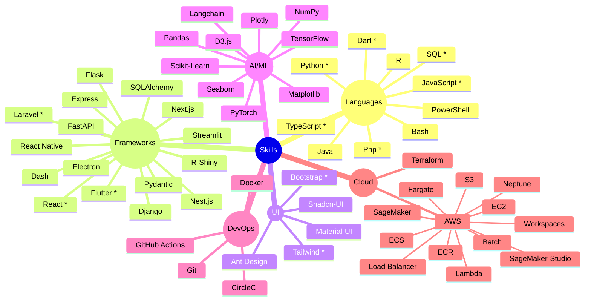

  

  

  

<h3 align="center">Empowering Africa through AI, Fintech, and E-commerce — One innovation at a time!</h3>
 

👋 Hey there, I'm Josphat Ndhlovu!  
🚀 Tech entrepreneur | Full-stack Developer | AI Enthusiast | Visionary Founder of **Ozzene**  

I'm passionate about building **AI-powered solutions**, **e-commerce platforms**, and **fintech ecosystems** that transform how people interact with technology in **Zimbabwe and beyond** 🌍.

## What I'm Working On 🔥

<table>
  <tr>
    <td align="center" width="50%">
       
      <strong>Ozzene</strong> 
      An all-in-one e-commerce ecosystem with vendor, shop, and delivery apps
    </td>
    <td align="center" width="50%">
       
      <strong>Unified Digital Fintech Wallet</strong> 
      Consolidating Ecocash, Innbucks, OneMoney, Omari & Zimswitch into one seamless payment gateway 💳
    </td>
  </tr>
</table>

### Tech Stack 

### Vision 🌐
Building Africa's next **tech powerhouse** — empowering businesses and individuals through **AI, e-commerce, and fintech innovation**.

 
  
  
  

 

  <h2>🏆 My GitHub Trophies 🏆 </h2>
   
  
   

<!-- GitHub Stats Section -->
<h2 align="center">📈 GitHub Stats</h2>

  
  

 

  

 

 
<h1 align="center">
    
</h1>
 
